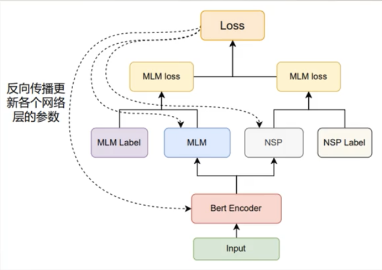

            Loss
             |
   |   ---       ---     |
  MLM                   NSP
   |                     |
    ---   Bert Encoder  --- 
              |
            Input
Bert Encoder:采取默认12层的Transformer Encoder Layer对输入进行编码, 
            [Multi-Head Attention多头注意力机制]
            [Add & Norm 残差与Layer Normalization]
            [Feed Forward 前馈神经网络] 
            实际：
            input -> Token Embeddings[i] + Segment Embeddings[i] + Postion Embeddings[i]
MLM:掩蔽语言模型（Masked Language Modeling）,遮住句子中若干个词通过周围词去预测被遮住的词
    
    三层结构 ： 激活函数（Dense(ReLu)） -> 规范化（Layer Normalization） -> 全连接层（Softmax(Token数量)）
    
    每个句子中随机选择15%位置的词语进行遮盖动作
    个高时80%退化为<Mask>,10%替换为随机词元(增加噪音，防止过拟合) 过程中<CLS>与<SEP>不会被替换
    例如[“<CLS>”, “my”, “dog”, “is”, “cute”,,“<SEP>”, “he”, “likes”, “play”, "##ing”,“ <SEP>”]
    变为[“<CLS>”, “my”, “<mask>” “is”, “dog” “<SEP>”, "he”, “likes”, “play", “<mask>” ,“ <SEP>”]

NSP:下一个句子预测（Next Sentence Prediction）,判断句子B在文章是否属于句子A的下一个句子
    输入：Bert Encoder层输出<CLS>位置的张量(也就是序列中的首位)，形状为[Batch Size, Emd dim]
    中间：一个MLP的结构。 默认是一个输出维度为2的，激活函数为Softmax的全连接层,其实它是一个二分类的Softmax，sigmod函数也行，论文中这么写的
    输出：类别分布张量。 形状为[Batch Size, 2]
    采样：采样时，50%的概率将第二句句子随机替换为段落中的任意一个句子

